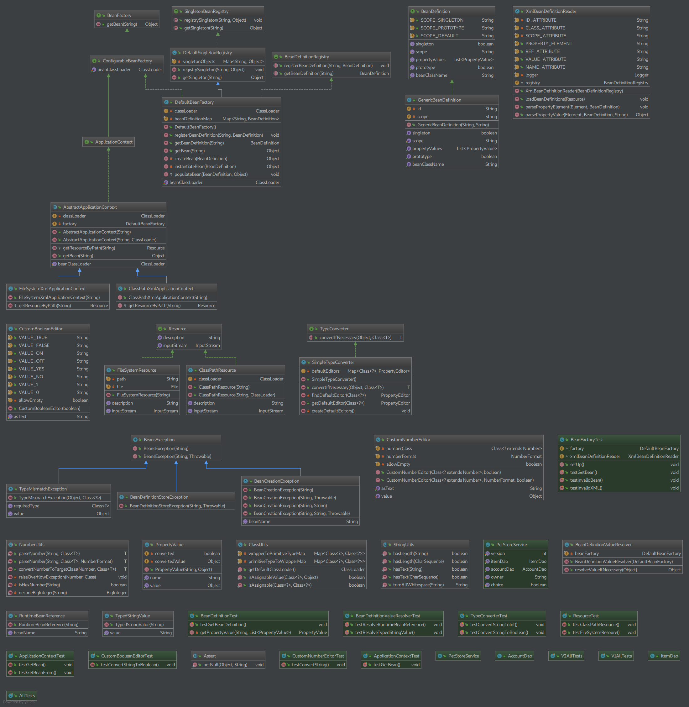
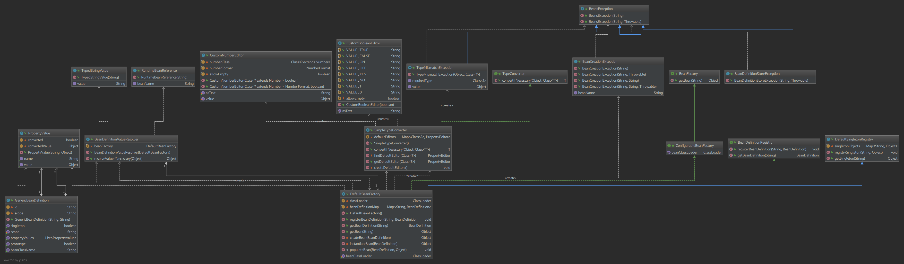

# ReZero

## lite spring

### Bean Factory

### Setter

1. Method Doc

 - isAssignableFrom : The java.lang.Class.isAssignableFrom() determines if the class or interface represented by this Class object is either the same as, or is a superclass or superinterface of, the class or interface represented by the specified Class parameter.

## RPC

